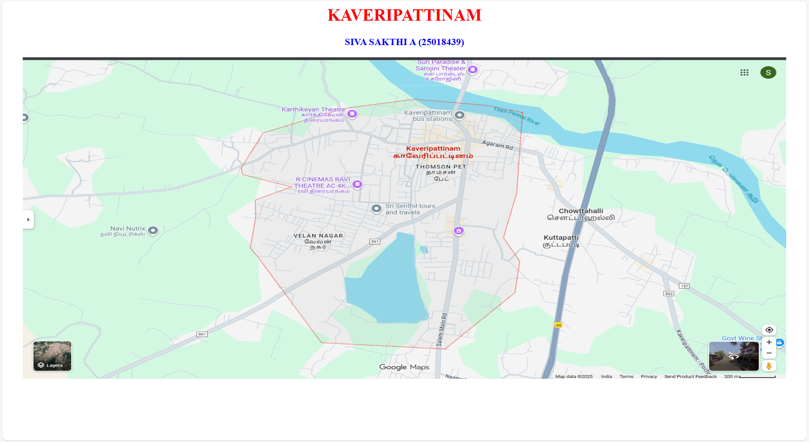
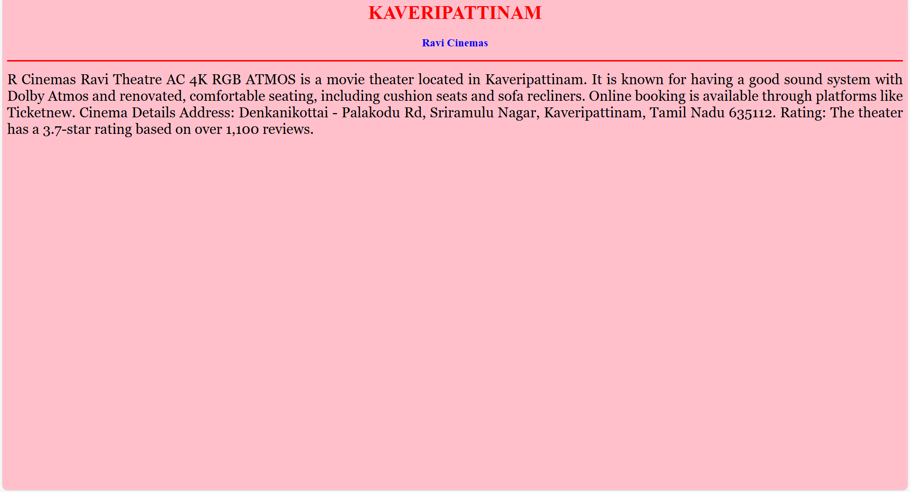
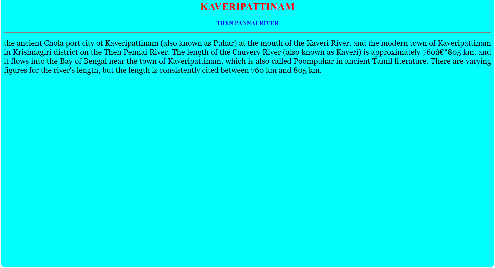
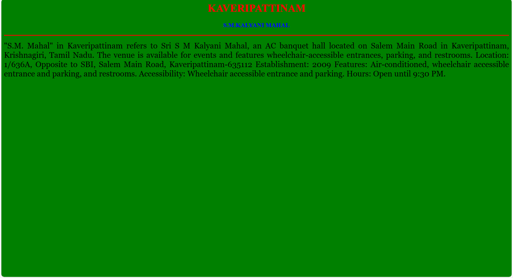
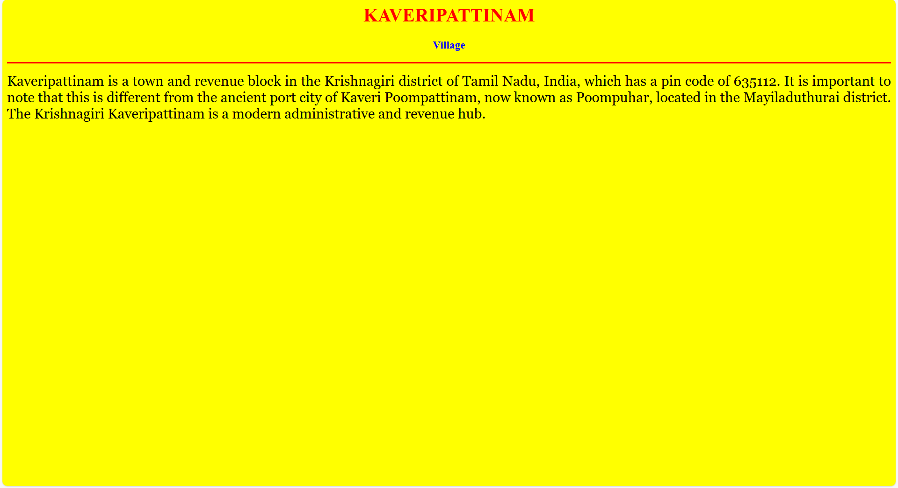

# Ex04 Places Around Me
## Date: 30.10.2025

## AIM
To develop a website to display details about the places around my house.

## DESIGN STEPS

### STEP 1
Create a Django admin interface.

### STEP 2
Download your city map from Google.

### STEP 3
Using ```<map>``` tag name the map.

### STEP 4
Create clickable regions in the image using ```<area>``` tag.

### STEP 5
Write HTML programs for all the regions identified.

### STEP 6
Execute the programs and publish them.

## CODE
```
map.html

<html>

<head>

<title>My City</title>

</head>
<body>

<h1 align="center">

<font color="red"><b>KAVERIPATTINAM</b></font>

</h1>

<h3 align="center">

<font color="blue"><b> SIVA SAKTHI A (25018439)</b></font> </h3>

<center>

 <map name="MyCity">

<area shape="rect" coords="750,500,750,750" href="map.html" title="My Home Town">
<area shape="circle" coords="570,230,45" href="cinemas.html" title="Ravi Cinemas">
<area shape="circle" coords="640,200,30" href="river.html" title=" Then pennai River">
<area shape="rect" coords="750,500,1000,140" href="village.html" title="Kuttapatti">
<area shape="rect" coords="900,500,750,750" href="mahal.html" title="S.M.Kalyani Mahal">

</map>

</center>

</body>

</html>

river.html

<html>
    <head>
        <title>THEN PANNAI RIVER</title>
        </head>

<body bgcolor="cyan">

<h1 align="center">

<font color="red"><b>KAVERIPATTINAM</b></font>

</h1>


<h3 align="center">


<font color="blue"><b> THEN PANNAI RIVER</b></font>


</h3>


<hr size="3" color="red">


<p align="justify">


<font face="Georgia" size="5">


the ancient Chola port city of Kaveripattinam (also known as Puhar) at the mouth of the Kaveri River, and the modern town of Kaveripattinam in Krishnagiri district on the Then Pennai River.
The length of the Cauvery River (also known as Kaveri) is approximately 760–805 km, and it flows into the Bay of Bengal near the town of Kaveripattinam, which is also called Poompuhar in ancient Tamil literature. There are varying figures for the river's length, but the length is consistently cited between 760 km and 805 km.</font>


</p>


</body>

</html>
    </head>
</html>


cinemas.html

<html>
    <head>
        <title>Ravi Cinemas</title>
        </head>

<body bgcolor="pink">

<h1 align="center">

<font color="red"><b>KAVERIPATTINAM</b></font>

</h1>


<h3 align="center">


<font color="blue"><b> Ravi Cinemas </b></font>


</h3>


<hr size="3" color="red">


<p align="justify">


<font face="Georgia" size="5">
R Cinemas Ravi Theatre AC 4K RGB ATMOS is a movie theater located in Kaveripattinam. It is known for having a good sound system with Dolby Atmos and renovated, comfortable seating, including cushion seats and sofa recliners. Online booking is available through platforms like Ticketnew. 
Cinema Details
Address: Denkanikottai - Palakodu Rd, Sriramulu Nagar, Kaveripattinam, Tamil Nadu 635112.
Rating: The theater has a 3.7-star rating based on over 1,100 reviews.

</font>


</p>


</body>

</html>
    </head>
</html>


village.html

<html>
    <head>
        <title>Village </title>
        </head>

<body bgcolor="yellow">

<h1 align="center">

<font color="red"><b>KAVERIPATTINAM</b></font>

</h1>


<h3 align="center">


<font color="blue"><b> Village </b></font>


</h3>


<hr size="3" color="red">


<p align="justify">


<font face="Georgia" size="5">
Kaveripattinam is a town and revenue block in the Krishnagiri district of Tamil Nadu, India, which has a pin code of 635112. It is important to note that this is different from the ancient port city of Kaveri Poompattinam, now known as Poompuhar, located in the Mayiladuthurai district. The Krishnagiri Kaveripattinam is a modern administrative and revenue hub. 
</font>


</p>


</body>

</html>
    </head>
</html>

mahal.html

<html>
    <head>
        <title>S.M.KALYANI MAHAL</title>
        </head>

<body bgcolor="green">

<h1 align="center">

<font color="red"><b>KAVERIPATTINAM</b></font>

</h1>


<h3 align="center">


<font color="blue"><b> S.M.KALYANI MAHAL</b></font>


</h3>


<hr size="3" color="red">


<p align="justify">


<font face="Georgia" size="5">


"S.M. Mahal" in Kaveripattinam refers to Sri S M Kalyani Mahal, an AC banquet hall located on Salem Main Road in Kaveripattinam, Krishnagiri, Tamil Nadu. The venue is available for events and features wheelchair-accessible entrances, parking, and restrooms. 
Location: 1/636A, Opposite to SBI, Salem Main Road, Kaveripattinam-635112
Establishment: 2009
Features: Air-conditioned, wheelchair accessible entrance and parking, and restrooms.
Accessibility: Wheelchair accessible entrance and parking.
Hours: Open until 9:30 PM.</font>


</p>


</body>

</html>
    </head>
</html>

```

## OUTPUT







## RESULT
The program for implementing image maps using HTML is executed successfully.
